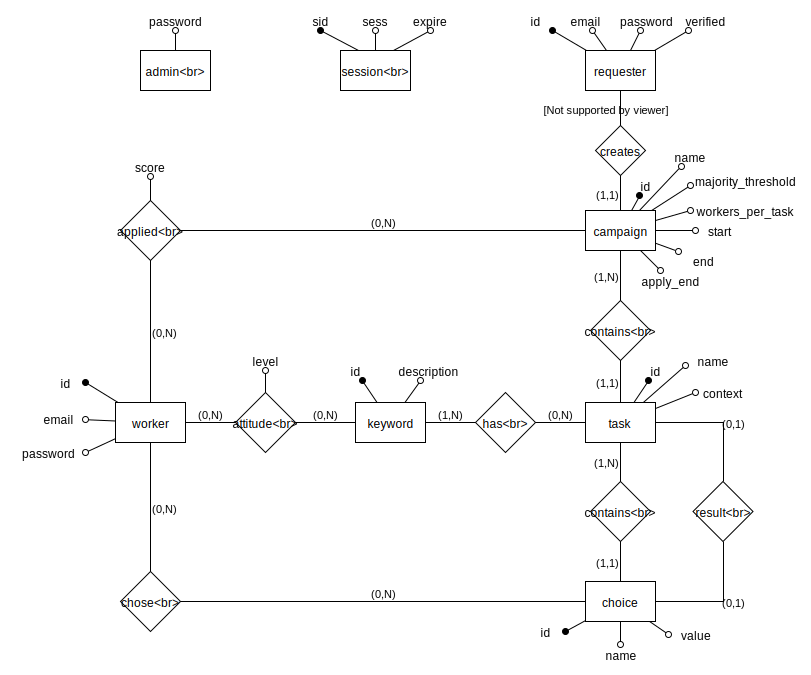

# Strumenti software

- Docker
- PostgreSQL
- NodeJs
- SCSS
- HTML5
- mustache
- js

# Progettazione database
## Schema concettuale


## Schema ER


### Considerazioni su schema ER
#### Utenti
Ci sono tre tipologie di utenti, worker, requester e admin.
L'admin e' un utente unico con nome utente predefinito e password modificabile.
Mentre il numero di worker e requester non e' fissato. Hanno inoltre attributi simili, ma il requester ne presenta uno in piu', e hanno relazioni diverse.
Quindi ho scelto di mantenere le entita' figlie invece di raggrupparle in un'entita' padre. Mantenendo cosi' le singole tabelle a risparmio dello spazio che avrebbe occupato ogni worker con un attributo sempre null.

## Schema relazionale
`requester(id, email, password, verified)`

`worker(id, email, password)`

`campaign(id, name, majority_threshold, workers_per_task, start, end, apply_end, requester)`

`task(id, name, context, campaign, result*(choice.id))`

`choice(id, name, value, task)`

`keyword(id, description)`

`task_keyword(task, keyword)`

`worker_attitude(worker, keyword, level)`

`worker_campaign(worker, campaign, score)`

`worker_choice(worker, choice)`

### Tabelle ausiliarie
`admin(password)`

`session(sid, sess, expire)`

## Scelte progettuali

### Gestione keyword
Le keyword sono gestite con dei suggerimenti proposti al requester per la keyword che stà digitando.
I suggerimenti sono l'insieme delle keyword tali che l'input dell'utente ne è una sottostringa.
In questo modo l'utente ha tutta la liberta di scegliere le keyword che desidera tenendo sott'occhio le keyword "simili" gia conosciute dall'applicazione.

Questa soluzione permette di evitare doppioni dovuti all'uso del plurale e altri suffissi o prefissi.

La scelta di suggerire keyword che contengono l'input dell'utente come sottostringa è dovuta alla disponibilita dell'operatore sql `LIKE` e la sua semplicita di utilizzo.

### Profilo lavoratore
Il grado di competenza/attitudine di un lavoratore rispetto ad una keyword è rappresentato da un numero intero positivo.
Una keyword non associata al lavoratore si considera a livello zero.
Tutti i lavoratori al momento dell'iscrizione, non hanno keyword associate e quindi hanno tutte le competenze/attitudini a livello zero.

Successivamente allo svolgimento di un task che risulta valido, vengono aggiornati i profili dei lavoratori che lo hanno eseguito, incrementando o decrementando di uno il livelo delle keyword associate al task.
Tutte le competenze/attitudini che si trovano a livello zero in un certo istante, vengono disassociate dal profilo del lavoratore in quanto il livello zero è sottinteso per tutte le keyword per tutti i lavoratori se non altrimenti specificato.

### Assegnazione task
```
function: db/sql/1-functions.sql:assign_task
```
L'assegnazione di un task al lavoratore che ne fa richiesta all'interno di una campagna di lavoro è gestita mediante un indice detto `P` calcolato per ogni task della della campagna di lavoro.

Dato un lavoratore che fa richiesta di un task, gli verrà assegnato il task con l'indice `P` massimo tra i task non completati di quella campagna.

```
P(task) := somma dei livelli di competenza/attitudine del lavoratore nei confronti delle keyword associate al task
```

Per esempio un lavoratore appena iscritto ha tutte le competenze/attitudini a livello zero, quindi la scelta del task da assegnare diventa casuale.

Al lavoratore non viene preclusa la possibilita' di eseguire task che non gli competono in parte o completamente. Al fine di permettere ai lavoratori di modellare indipendentemente e "inconsciamente" il proprio profilo per rispecchiare il piu possibile la realta'.

### Aggiornamento profilo lavoratore
```
trigger: db/sql/1-functions.sql:complete_task
```
Dato che tutti i lavoratori hanno tutte le keyword a livello zero se non altrimenti specificato.
L'aggiornamento del profilo di un lavoratore avviene incrementando o decrementando di uno il livello associato alla keyword, in base all'appartenenza del lavoratore al gruppo che ha dato la risposta maggioritaria.
Se la keyword viene decrementata al livello zero viene disassociata dal lavoratore e assume il suo valore di default che e' zero, altrimenti, se la keyword viene incrementata a livello uno, dovra' essere associata al lavoratore esplicitamente in quanto possiede ora un livello maggiore di zero.

# Progettazione web
Gli `endpoint` dell'applicazione:
```
  - /
    - GET signup/
    - POST signup/ {user: ['worker', 'requester']}
    - GET login/
    - GET keywords/suggestions/{keyword}/
  - requester/
    - GET verification/
    - POST login {email, password}/
    - GET logout/
    - GET campaigns/
    - GET report/{campaign-id}/
    - GET new-campaign/
    - POST new-campaign/ {
        name: string,
        majority_threshold: integer,
        workers_per_task: integer,
        apply_end: datetime,
        start: datetime,
        end: datetime,
        tasks: [
          title: string,
          context: string,
          choices: [{name: string, value: string}],
          keywords: [string]
        ]
    }
  - worker
    - POST login/ {email, password}
    - GET logout/
    - GET campaigns/
    - POST campaigns/apply/{campaign-id}/
    - GET campaign/{campaign-id}/task/
    - POST campaign/{campaign-id}/task/{task-id}/choice/ {choice: string}
```
